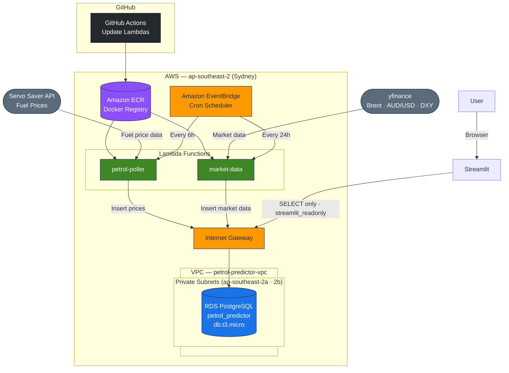

# Petrol_Prices
Forecast VIC Petrol Prices

Application runs in AWS to select data from inputs sources and store in database. Streamlit app to run the front end for users.



## Input Sources:
- VIC Servo Saver API
- Financial market data from ```yfinance``` package

## Flow
- EventBridge schedules Lambda functions to select the data and insert into RDS Postgres database
- The Lambda environment runs as in image which is stored in ECR, this is updated with Github actions on changes to main.
- Secrets manager stores the keys
- CloudWatch alarms are set to notify of errors via SNS

## Next Steps
- Develop a model to forecast petrol prices
- Serve this to a website for the public


# Supabase
Flow was orignally run with Github actions and Supabase. This has been mirgated to AWS. The supabase and Github actions runs are still supported at the moment.
