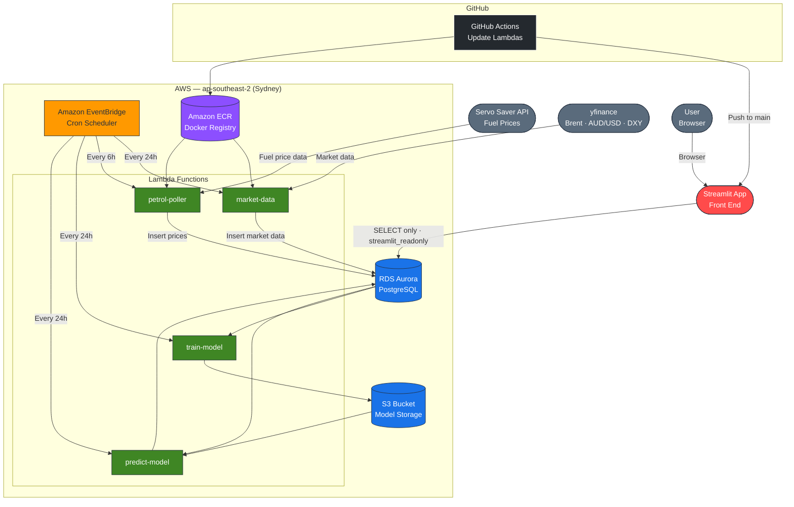

# Petrol_Prices
Forecast VIC Petrol Prices

**Live Site:** [https://petrolprices-vic.streamlit.app/](https://petrolprices-vic.streamlit.app/)

Application runs in AWS to select data from inputs sources and store in database. Streamlit app to run the front end for users.



## Input Sources:
- [VIC Servo Saver API](https://service.vic.gov.au/find-services/transport-and-driving/servo-saver)
- Financial market data from ```yfinance``` package

## Flow
- EventBridge schedules Lambda functions to select the data and insert into RDS database
- The Lambda environment runs as in image which is stored in ECR, this is updated with Github actions on changes to main.
- Models are trained and stored in S3
- Predictions write to the database and allow the Streamlit app to read the requirement data
- CloudWatch alarms are set to notify of errors via SNS
